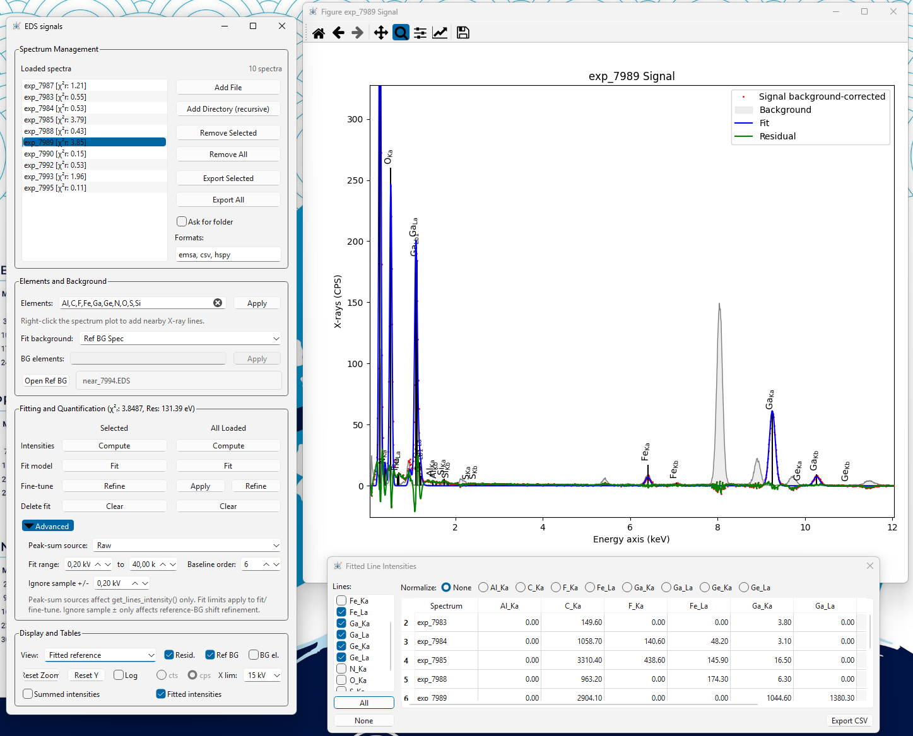

# EDS Tool

EDS Tool is an interactive HyperSpy/exSpy based program for TEM EDS spectrum
analysis. It is designed for sessions with one or many spectra, a measured
reference/background spectrum, model fitting, refinement, intensity tables, and
export of spectra and fit state.



## Main Capabilities

- Load individual `.eds` / `.hspy` spectra or directories of spectra.
- Prefer `.hspy` analysis snapshots over same-stem `.eds` files when both exist.
- Apply sample elements to one spectrum or a whole multi-spectrum session.
- Add element markers from the spectrum plot by right-clicking near x-ray lines.
- Model spectra with sample x-ray lines, a polynomial baseline, and optional
  reference-background spectrum.
- Fit, refine, and clear fits for selected spectra or all loaded spectra.
- Show raw, fitted-reference-background-subtracted, or measured-background-
  subtracted spectrum views.
- Show fitted model, residual, reference background, and x-ray line markers.
- Compute peak-sum and fitted intensities and display them in interactive tables.
- Export spectra, plots, intensity tables, and `.hspy` snapshots that preserve
  EDS Tool state.

## Running the Program

From the repository, run Python through the `eds-mini` wrapper:

```powershell
powershell -ExecutionPolicy Bypass -File .\scripts\with-eds-mini.ps1 python eds_tool.py grain1_thin.eds
```

Load multiple spectra and a reference background:

```powershell
powershell -ExecutionPolicy Bypass -File .\scripts\with-eds-mini.ps1 python eds_tool.py acac --elements C,O,Fe,Al,Ga,Ge,N --bg-spectrum acac\near_7994.EDS
```

Run automatic non-GUI export:

```powershell
powershell -ExecutionPolicy Bypass -File .\scripts\with-eds-mini.ps1 python eds_tool.py grain1_thin.eds --elements C,O,Na,S,Si,K,Cu --bg-spectrum bg_near_grain1_thin.eds --auto
```

Useful CLI options:

- `--elements C,O,Fe`: initial sample element list.
- `--bg-elements Cu,Au`: background/parasitic elements for BG-elements mode.
- `--bg-spectrum path`: measured reference-background spectrum.
- `--energy-resolution 128`: initial detector resolution at Mn Ka in eV.
- `--cps`: show signal-only views in CPS initially.
- `--max-energy 15`: maximum plot energy in auto mode.

## Recommended Workflow

### 1. Load Spectra

Use `Add File` for individual spectra or `Add Directory (recursive)` for a
folder. The loaded-spectra list is intended for many spectra; use Up/Down keys
when the list has focus.

If `.hspy` files exist next to `.eds` files with the same stem, EDS Tool loads
the `.hspy` version because it may contain saved fit state.

### 2. Set Elements

Enter sample elements in the `Elements` box, for example:

```text
C,O,Fe,Al,Ga,Ge,N
```

Click `Apply` to apply the element list. If existing models are present, they
are re-fitted with the new elements.

Right-click the spectrum plot to add nearby x-ray lines. This only stages the
element in the text field and updates plot markers. Click `Apply` to re-fit.

### 3. Set Background Modeling

Choose `Fit background`:

- `Ref BG Spec`: recommended when a measured reference/background spectrum is
  available.
- `BG Elements`: use known parasitic/background elements when no measured
  reference spectrum is available.
- `None`: no external/reference background component; the polynomial baseline
  is still fitted.

For `Ref BG Spec`, click `Open Ref BG` and select the reference/background
spectrum. The fit uses CPS-normalized signal and reference spectra so different
live times are handled correctly.

For `BG Elements`, enter the parasitic elements and click the adjacent `Apply`.
Fitted background subtraction is only separable when BG elements do not overlap
sample elements.

### 4. Fit Models

In `Fitting and Quantification`:

- `Fit` under `Selected`: fit only the active spectrum.
- `Fit` under `All Loaded`: fit all loaded spectra.
- `Clear`: remove fit state.
- `Refine`: run energy/refinement calibration.
- `Apply`: apply the active refined calibration to other fitted spectra and
  re-fit them.

The frame title shows fit quality for the active spectrum:

```text
chi2r: ..., Res: ... eV
```

During fitting/refinement, the command window prints detailed progress,
including reference-background prefit, low-energy screening, function
evaluations, and chi-square values.

### 5. Refine Fits

Use `Refine` after an initial fit when peaks are shifted or the detector
resolution needs calibration. The refinement protocol calibrates:

- Overall spectrum energy offset.
- Reference-background shift, if a reference spectrum is used.
- Detector resolution, using a constrained candidate search.

Refinement should normally improve the residual without making later re-fitting
unstable.

### 6. Inspect the Display

The `Display and Tables` section controls what is shown:

- `View`
  - `Raw`: raw spectrum, with model/residual if fitted.
  - `Fitted reference`: subtract the fitted reference background from both
    signal and displayed model.
  - `Subtract measured`: directly subtract measured reference background as a
    signal-only view.
- `Resid.`: show fit residual.
- `Ref BG`: show fitted reference background; before fitting, shows the raw
  reference background in CPS.
- `BG el.`: show background-element markers.
- `Reset Zoom`: reset both axes, respecting selected x-limit.
- `Reset Y`: reset only the y-axis.
- `Log`: toggle logarithmic y-axis.
- `cts` / `cps`: switch signal-only display units.
- `X lim`: choose 5, 15, or 40 kV display range.
- `Summed intensities`: show peak-sum table.
- `Fitted intensities`: show model-derived intensity table.

The display is separate from fit input. Fitting always uses the raw spectrum
normalized to CPS, not the current display view.

### 7. Advanced Fit Settings

Expand `Advanced` in `Fitting and Quantification` for:

- `Peak-sum source`: signal source used by peak-sum intensities.
- `Fit range`: lower and upper energy limits used for fitting/refinement.
- `Baseline order`: polynomial baseline order.
- `Ignore sample +/-`: half-width around sample lines excluded during masked
  reference-background shift refinement.

Defaults are suitable for most current workflows:

- Fit range: `0.20 kV` to `40.00 kV`.
- Baseline order: `6`.
- Ignore sample: `0.20 kV`.

### 8. Export

Set export formats in `Formats`, for example:

```text
emsa, csv, hspy
```

Use:

- `Export Selected`: export active spectrum.
- `Export All`: export all spectra.
- `Ask for folder`: choose an output folder instead of writing next to data.
- `Export CSV` in intensity tables: export the currently displayed table.

Use `.hspy` when you want to preserve EDS Tool state for later reloading.

## Background and Signal Views

EDS Tool distinguishes three ideas that are often confused:

- Polynomial baseline: smooth continuum component inside the fit model.
- Reference/background spectrum: measured external/parasitic background modeled
  by the `instrument` component.
- Display subtraction: a derived view shown or exported for inspection.

The polynomial baseline is not subtracted by `Fitted reference`. That view only
subtracts the fitted external/reference background.

## Intensity Tables

Two table types are available:

- Summed intensities: HyperSpy peak-sum intensities from the selected
  `Peak-sum source`.
- Fitted intensities: model-derived line intensities from the fitted model.

The fitted intensity table can normalize values by selected lines and can show
or hide individual line columns.

## Troubleshooting

### Fit is slow

Check the command-window output:

- Large `nfev` in the initial bounded fit often indicates an unsupported
  low-energy element or a poorly conditioned low-energy baseline.
- Verify the element list. Extra elements are allowed, but absent low-energy
  elements can still make interpretation harder.
- Use `Ref BG Spec` when a measured background spectrum is available.
- Keep `instrument.xscale` fixed; it is not a useful GUI control.

### Fit quality is poor between peaks

Possible causes:

- Reference background is wrong or not representative.
- Missing element in the sample list.
- Too many unsupported low-energy elements.
- Baseline order too low or too high for the spectrum.
- Very low-energy detector artifacts not represented by the reference spectrum.

Inspect `Fitted reference` view, residual, and `Ref BG` overlay.

### Fitted reference subtraction is unavailable

It requires a fitted model and an identifiable external/reference background:

- Available in `Ref BG Spec` after fitting.
- Available in `BG Elements` only if sample elements and BG elements are
  disjoint.
- Not available in `None` mode.

### Measured subtraction looks different from fitted reference subtraction

This is expected. Measured subtraction directly subtracts the reference spectrum
scaled by live time. Fitted reference subtraction subtracts the model's fitted
reference-background contribution.

### Counts and CPS differ

Fitting uses CPS internally. Counts are available for signal-only display and
export. If the reference spectrum has a different live time, CPS is the correct
space for fitting.

### Right-click element additions do not re-fit immediately

This is intentional. Right-clicking stages suggested elements and updates line
markers. Click `Apply` to re-fit, which avoids expensive accidental batch
re-fits.

### GUI appears frozen during fitting

Fitting is currently synchronous. A small progress dialog is shown while the
operation runs; detailed progress is printed in the command window.

### Reloaded spectra use `.hspy` instead of `.eds`

This is intentional when both files exist with the same stem. `.hspy` may
contain saved EDS Tool fit state.

## Development Notes

Architecture and implementation details are in:

- `PROGRAM_STRUCTURE.md`
- `FITTING_TESTS.md`
- `tests/TESTS.md`

Run tests with:

```powershell
powershell -ExecutionPolicy Bypass -File .\scripts\with-eds-mini.ps1 python tests\test_fit_protocol_module.py
```
